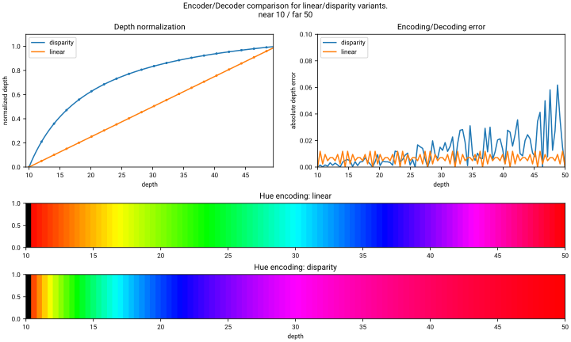

# hue-encoding
This project provides efficient vectorized Python code to perform depth `<->` color encoding based on

> Sonoda, Tetsuri, and Anders Grunnet-Jepsen.
"Depth image compression by colorization for Intel RealSense depth cameras." Intel, Rev 1.0 (2021).

Here's the encoding of depth values from a moving sine wave.

https://github.com/user-attachments/assets/2814d21a-3d1b-4857-b415-dc1c5ae31460


## Properties

The encoding is designed to transform 16bit single channel images to RGB color images that can be processed by standard (lossy) image codec with minimal compression artefacts. This leads to a compression factor of up to 80x.

## Method

The compression first transforms raw depth values to the applicable encoding range [0..1530] (~10.5bit) via a normalization strategy (linear/disparity) using a user provided near/far value. Next, for each encoding value the corresponding color is computed. The color is chosen carefully to respect the aforementioned properties. Upon decoding the reverse process is computed.

## Implementation

This implementation is vectorized using numpy and can handle any image shapes `(*,H,W) <-> (*,H,W,3)`. For improved performance, we precompute encoder and decoder lookup tables to reduce encoding/decoding to a simple lookup. The lookup tables require ~32MB of memory. Use `use_lut=False` switch to rely on the pure vectorized implementation. See benchmarks below for effects.

## Usage

There is currently no PyPi package to install, however the code is contained in a single file for easy of distribution :)

```python
# Import
import huecodec as hc

# Random float depths
d = rng.random((5,240,320), dtype=np.float32)*0.9 + 0.1

# Encode
rgb = hc.depth2rgb(d, zrange=(0.1,1.0), inv_depth=False)
# (5,240,320,3), uint8

# Decode
depth = hc.rgb2depth(rgb, zrange=(0.1,1.0), inv_depth=False)
# (5,240,320), float32
```

## Benchmark

Here are benchmark resoluts for encoding/decoding float32 depthmaps of varios sizes with and without lookup tables.

```
------------- benchmark: 8 tests ------------
Name (time in ms)              Mean          
---------------------------------------------
enc_perf[LUT-(640x480)]        2.1851 (1.0)    
dec_perf[LUT-(640x480)]        2.2124 (1.01)   
enc_perf[LUT-(1920x1080)]     17.9139 (8.20) 
dec_perf[LUT-(1920x1080)]     16.4741 (7.54)   
enc_perf[noLUT-(640x480)]     22.3938 (10.25)  
dec_perf[noLUT-(640x480)]      6.9320 (3.17)   
dec_perf[noLUT-(1920x1080)]   74.6038 (34.14)  
enc_perf[noLUT-(1920x1080)]  158.0871 (72.35)  
---------------------------------------------
```

## Depth transformations
The encoding allows for linear and disparity depth normalization. In linear mode, equal depth ratios are preserved in the encoding range [0..1530], whereas in disparity mode more emphasis is put on closer depth values than on larger ones, leading to more accurare depth resolution closeup.



## Notes

The original paper referenced is potentially inaccurate in its equations. This has been noted in varios posts [#10415](https://github.com/IntelRealSense/librealsense/issues/10145),[#11187](https://github.com/IntelRealSense/librealsense/issues/11187),[#10302](https://github.com/IntelRealSense/librealsense/issues/10302).

This implementation is based on the original paper and code from
https://github.com/jdtremaine/hue-codec/.